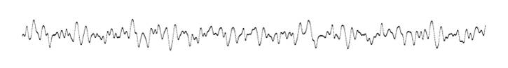
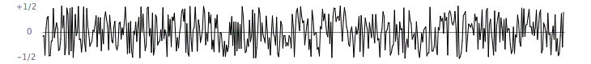
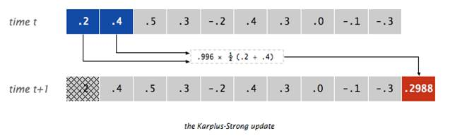
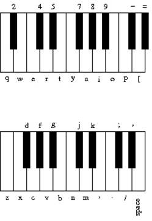
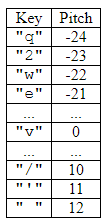

# Play a guitar!

A guitar simulator that lets you to record and play songs.

[Author: Bill Zhao](https://www.iambillzhao.com/)

## Usage and Dependency

Please use Java to compile this project, the client may need to turn off an 
option to make sure to the program runs successfully.
Please try `-Xlint:unchecked` in compile options if intial execution fails.

You can record a tune or play a tune using this guitar. Please check the
functionalities addressed below:

### RecordThatTone

Records your input with delays to simulate a song played by a guitar. A key-to-
pitch table is attched to the end of this documentation.

### PlayThatTone

A list of pre-recorded songs could be chosen from the program menu, you may 
find their specifications in the `play` folder (relative path):

```
arabesque.txt
arrietty.txt
Ascale.txt
asturias.txt
Big_Sur_Moon.txt
canon.txt
chromatic.txt
clocks.txt
concerninghobbits.txt
CruellaDeVil.txt
elise.txt
elise_mid_track_1.txt
entertainer.txt
fifthsymphony.txt
filenames
filenames.txt
firstcut.txt
ForceAwakensReyTheme.txt
freebird.txt
friendship_mid_track_2.txt
Game of Thrones - theme.txt
GarryOwen.txt
god knows....txt
God-Rest-Ye-Merry-Gentlemen-Version1.txt
God-Rest-Ye-Merry-Gentlemen-Version2.txt
GokurakuJoudo3.txt
hanging-tree.txt
Havana
Here-Comes-the-Sun.txt
hotel-california.txt
ImperialMarch.txt
JohnCena_OctavDown.txt
Kiki's Delivery Service Theme Song.txt
Konosuba_ED1.txt
looney.txt
lostWoods.txt
madworld.txt
Mansion.txt
Mario.txt
MaskOff
MyFavSong.txt
National_Anthem.txt
NonpareilOfFavor
nyan.txt
old-nassau.txt
Pokemon-battle-theme.txt
Pokemon-RBY-Gym-Theme.txt
pokemon.txt
PokemonTitleScreenTheme.txt
portal.txt
portal2.txt
River_Flows_In_You.txt
Sandstorm.txt
Scary Monsters--Skrillex.txt
Sherlock-Theme.txt
SomeoneLikeYou2.txt
SovietUnion.txt
StairwayToHeaven.txt
stairwaytoheaven2.txt
take_on_me.txt
TheDrunkenWhaler.txt
tomsdiner.txt
WeAreNumberOne.txt
wilyfaster.txt
XO_Tour_Life.txt
zelda.txt
Zen
```

## Plucking the string

More info about utilizations of `stdAudio` and `stdDraw`:
http://introcs.cs.princeton.edu/java/stdlib/

When a guitar string is plucked, the string vibrates and creates sound. 
The length of the string determines its fundamental frequency of vibration. 
Modeling a guitar string by sampling its displacement (a real number between 
-1/2 and +1/2) at N equally spaced points (in time), where N equals the 
sampling rate (44,100) divided by the fundamental frequency (rounded to 
the nearest integer).

The excitation of the string can contain energy at any frequency. Simulating 
the excitation by filling the ring buffer with white noise: set each of the 
N sample displacements to a random real number between -1/2 and +1/2.




## The resulting vibrations

After the string is plucked, the string vibrates. The pluck causes a 
displacement which spreads wave-like over time. The Karplus-Strong 
algorithm simulates this vibration by maintaining a ring buffer of the 
N samples: for each step the algorithm deletes the first sample from the 
ring buffer and adds to the end of the ring buffer the average of the 
first two samples, scaled by an energy decay factor of 0.996.



## Why it works

The two primary components that make the Karplus-Strong algorithm work 
are the ring buffer feedback mechanism and the averaging operation.

- The ring buffer feedback mechanism: The ring buffer models the medium 
(a string tied down at both ends) in which the energy travels back and 
forth. The length of the ring buffer determines the fundamental frequency 
of the resulting sound. Sonically, the feedback mechanism reinforces only 
the fundamental frequency and its harmonics (frequencies at integer 
multiples of the fundamental). The energy decay factor (.996 in this 
case) models the slight dissipation in energy as the wave makes a 
roundtrip through the string.

- The averaging operation: The averaging operation serves as a gentle 
low pass filter (which removes higher frequencies while allowing lower 
frequencies to pass, hence the name). Because it is in the path of the 
feedback, this has the effect of gradually attenuating the higher 
harmonics while keeping the lower ones, which corresponds closely 
with how actually plucked strings sound.

## Part 1: GuitarString

* `GuitarString( double frequency )`: Constructs a guitar string of 
the given frequency.  It creates a ring buffer of the desired capacity 
N (sampling rate divided by frequency, rounded to the nearest integer), 
and initializes it to represent a guitar string at rest by enqueueing 
N zeros.  The sampling rate is specified by the constant 
`StdAudio.SAMPLE_RATE`.  If the frequency is less than or equal to 0 
or if the resulting size of the ring buffer would be less than 2, 
Throws an `IllegalArgumentException`.

* `GuitarString( double[] init )`: Constructs a guitar string and 
initializes the contents of the ring buffer to the values in the 
array.  If the array has fewer than two elements, the constructor 
should throw an `IllegalArgumentException`.  This constructor is 
used only for testing purposes.

* `void pluck( )`: This method should replace the N elements in the 
ring buffer with N random values between -0.5 inclusive and +0.5 
exclusive (i.e. -0.5 <= value < 0.5).

* `void tic( )`: This method should apply the Karplus-Strong update 
once.  It should delete the sample at the front of the ring buffer 
and add to the end of the ring buffer the average of the first two 
samples, multiplied by the energy decay factor (0.996).

* `double sample( )`: This method should return the current sample 
(the value at the front of the ring buffer).

## Part 2: Guitar37

There could be many possible guitar objects with different kinds of strings. 
As a result, this introduces an interface known as Guitar that each guitar 
object implements.

The Guitar interface is defined as follows:

```
public interface Guitar {

    public void playNote(int pitch);

    public boolean hasString(char key);

    public void pluck(char key);

    public double sample();

    public void tic();

    public int time();
}
```

The interface allows a client to specify what to play in one of two ways.  
A client can specify exactly which note to play by calling the playNote 
method passing it a pitch.  Pitch is specified as an integer where the 
value 0 represents concert-A and all other notes are specified relative 
to concert-A using what is known as a chromatic scale.  Not every value 
of pitch can be played by any given guitar.  If it can’t be played, it 
is ignored.

A client can also specify a character that indicates which note to play 
by calling the pluck method.  Different guitar objects will have different 
mappings from characters to notes.  The interface includes a method called 
hasString that is paired with pluck that lets a client verify that a 
particular character has a corresponding string for this guitar.  
The pluck method has a precondition that the key is legal for this guitar.

The Guitar interface also has methods for getting the current sound sample 
(the sum of all samples from the strings of the guitar), to advance the 
time forward one “tic,” and an optional method for determining the current 
time (the number of times tic has been called).  If the time method is not 
implemented, it returns -1.

The Guitar37 class has a total of 37 notes on the chromatic scale from 110Hz 
to 880Hz. The i-th character of this string should correspond to the i-th 
character of your array:

`q2we4r5ty7u8i9op-[=zxdcfvgbnjmk,.;/' `

This use of keyboard characters imitates a piano keyboard, making playing 
songs a little easier for people used to a piano keyboard. The white keys 
are on the qwerty and zxcv rows and the black keys on the 12345 and asdf 
rows of the keyboard, as in the drawing below.



As noted above, a pitch of 0 is supposed to correspond to concert-A, 
which will be at index 24 for the Guitar37 object (corresponding to 
the character “v”). Thus, the client can convert from a pitch value 
to an index in your string by adding 24 to the pitch value.  
The table below shows some examples of this conversion. Try record
some songs on your own using `RecordThatTune.java`


